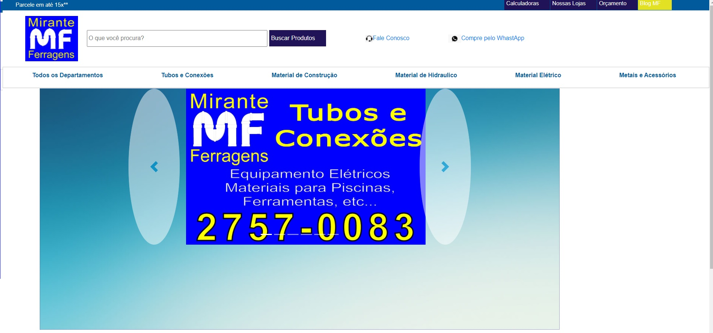
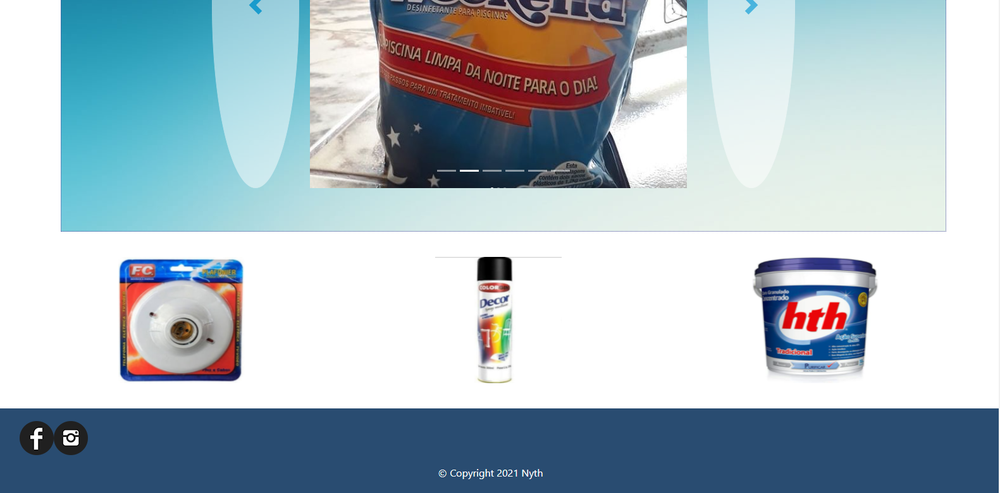

<h2> Site Mirante Ferragens </h2>

Esse projeto foi feito com html5/ CSS3.  
Site com catálogo de materiais de construção onde o cliente pode verificar os produtos que a loja possui e fazer um orçamento via whatsApp.
<strong> 
 Obs.: Site em construção. 
</strong>

 <ul class="clearfix">
       <li><a href="index.html" class="btn-custom">Index (Menu Principal)</a></li>
        <li><a href="calculadoras.html" class="btn-custom">Calculadoras</a></li>
        <li><a href="nossas-lojas.html" class="btn-custom">Nossas Lojas</a></li>
       </ul>
        

<h2> Rodapé </h2>
 
     

 

          <ul class="col-md-4 footer" >
            <li>
              
            </li>

             <li>
              
            </li>
          </ul>
           
         
           
       
 
          
       
